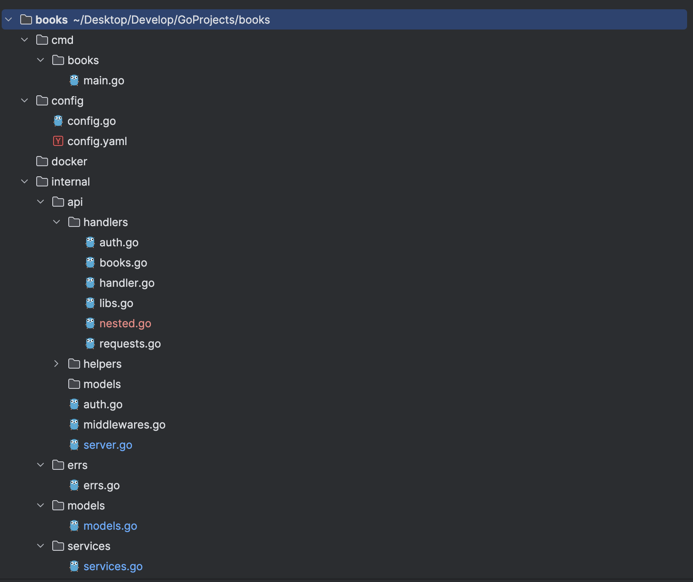
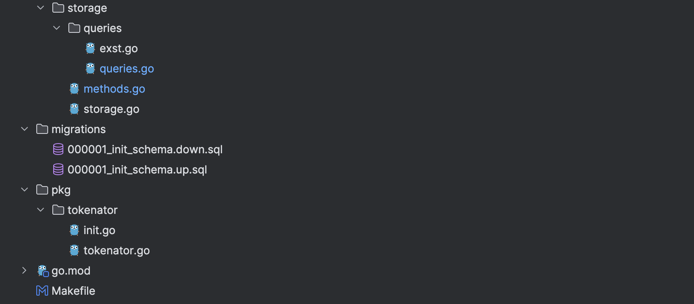
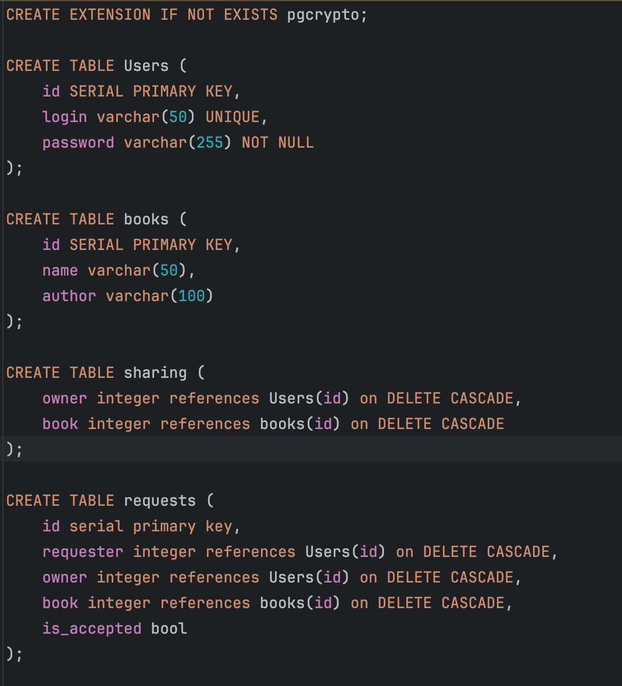

В качестве варианта для реализации мною была выбрана система для буккроссинга

# Структура проекта



# Миграции базы данных 


# Конфигурация приложения 

# Эндпоинты 
```go
func (s *Server) RegisterUser(c *gin.Context) {
	login := c.Query("login")
	password := c.Query("password")

	err := s.storage.CreateUser(login, password)
	if err != nil {
		c.AbortWithStatusJSON(http.StatusInternalServerError, helpers.NewJSONErr(err))
		return
	}

	c.AbortWithStatus(http.StatusOK)
}

func (s *Server) AuthUser(c *gin.Context) {
	login := c.Query("login")
	password := c.Query("password")

	res, err := s.storage.AuthUser(login, password)
	if err != nil {
		c.AbortWithStatusJSON(http.StatusInternalServerError, helpers.NewJSONErr(err))
		return
	}

	if res {
		token, err := s.tokenator.Generate(login)
		if err != nil {
			c.AbortWithStatusJSON(http.StatusInternalServerError, helpers.NewJSONErr(err))
			return
		}
		c.AbortWithStatusJSON(http.StatusOK, gin.H{"token": token})
		return
	} else {
		c.AbortWithStatusJSON(http.StatusBadRequest, helpers.NewJSONErr(errs.WrongCredentials))
		return
	}
}

func (s *Server) AuthMW(c *gin.Context) {
    token := c.GetHeader("token")
    res, login := s.tokenator.Check(token)
    
    if res {
        c.AddParam("login", login)
        c.Next()
    } else {
        c.AbortWithStatus(http.StatusUnauthorized)
        return
	}
}


```

```go
package handlers

import (
	"books/internal/api/helpers"
	"fmt"
	"github.com/gin-gonic/gin"
	"net/http"
	"strconv"
)

func (h *Handler) CreateBook(c *gin.Context) {
	author := c.Query("author")
	name := c.Query("name")

	err := h.storage.CreateBook(author, name)
	if err != nil {
		c.AbortWithStatusJSON(http.StatusInternalServerError, helpers.NewJSONErr(err))
		return
	}

	c.AbortWithStatus(http.StatusOK)
}

func (h *Handler) GetBooks(c *gin.Context) {
	res, err := h.storage.GetBooks()
	if err != nil {
		c.AbortWithStatusJSON(http.StatusInternalServerError, helpers.NewJSONErr(err))
		return
	}
	c.IndentedJSON(http.StatusOK, res)
}

func (h *Handler) AddBookToLib(c *gin.Context) {
	user := c.Query("login")
	bookStr := c.Query("bookID")
	bookID, _ := strconv.Atoi(bookStr)
	fmt.Println("book id: ", bookID)

	err := h.storage.AddBookToLib(user, bookID)
	if err != nil {
		c.AbortWithStatusJSON(http.StatusInternalServerError, helpers.NewJSONErr(err))
		return
	}

	c.AbortWithStatus(http.StatusOK)
}

```

```go
func (h *Handler) GetUserLib(c *gin.Context) {
	user := c.Query("user")
	userModel, err := h.storage.GetUser(user)
	if err != nil {
		c.AbortWithStatusJSON(http.StatusInternalServerError, gin.H{"error": err.Error()})
		return
	}

	books, err := h.storage.GetLibForUser(user)
	if err != nil {
		c.AbortWithStatusJSON(http.StatusInternalServerError, gin.H{"error": err.Error()})
		return
	}

	resp := models.Nested{
		User:  *userModel,
		Books: books,
	}

	c.JSON(http.StatusOK, resp)
}

```

```go
package handlers

import (
	"books/internal/api/helpers"
	"github.com/gin-gonic/gin"
	"net/http"
	"strconv"
)

func (h *Handler) CreateRequest(c *gin.Context) {
	requester := c.Query("requester")

	var req helpers.CreateRequestReq
	err := c.BindJSON(&req)
	if err != nil {
		c.AbortWithStatusJSON(http.StatusBadRequest, helpers.NewJSONErr(err))
		return
	}

	err = h.storage.CreateRequest(requester, req.Owner, req.BookID)
	if err != nil {
		c.AbortWithStatusJSON(http.StatusInternalServerError, helpers.NewJSONErr(err))
		return
	}

	c.AbortWithStatus(http.StatusOK)
}

func (h *Handler) GetRequestsList(c *gin.Context) {
	user := c.Query("login")

	list, err := h.storage.GetRequestsList(user)
	if err != nil {
		c.AbortWithStatusJSON(http.StatusInternalServerError, helpers.NewJSONErr(err))
		return
	}

	c.JSON(http.StatusOK, &list)
}

func (h *Handler) AcceptRequest(c *gin.Context) {
	id := c.Query("id")
	idInt, _ := strconv.Atoi(id)

	err := h.storage.AcceptRequest(idInt)
	if err != nil {
		c.AbortWithStatusJSON(http.StatusInternalServerError, helpers.NewJSONErr(err))
		return
	}

	c.AbortWithStatus(http.StatusOK)
}

```